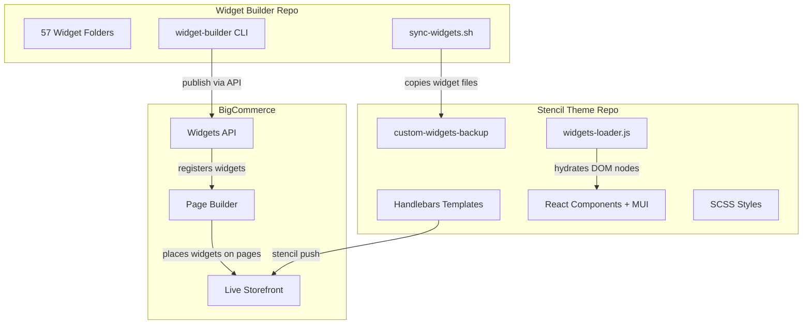
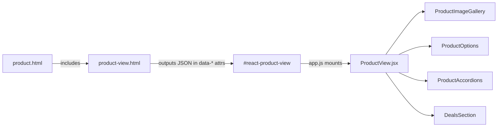

## System diagram

## How it works

### Widget lifecycle

1. **Develop** — A widget is created in the `widget-builder` repo as a folder containing `widget.html`, `schema.json`, `config.json`, and `meta.json`.
2. **Preview** — `widget-builder start <name>` opens a local preview at `localhost:8080`.
3. **Publish** — `widget-builder publish <name>` sends the widget template to the BigCommerce Widgets API. A UUID is stored in `widget.yml` for future updates.
4. **Sync** — `sync-widgets.sh to-stencil <name>` copies the widget files into the Stencil theme's `custom-widgets-backup/` directory for version control.
5. **Place** — Content editors drag the widget onto pages in Page Builder.
6. **Render** — On the live storefront, `widgets-loader.js` finds DOM nodes with `data-widget-type` attributes and hydrates them with the matching React component.

### Stencil theme rendering

The storefront uses a hybrid rendering model:

- **Server-side**: Handlebars templates render the initial HTML (product data, page layout, SEO markup).
- **Client-side**: React components mount into specific DOM nodes to provide interactive UI (product gallery, options selector, carousels, etc.).
- **Widgets**: Page Builder widgets are Handlebars templates that output `div` elements with `data-*` attributes. The `widgets-loader.js` script reads those attributes and renders the corresponding React component.

### PDP rendering flow

### Key files

| File | Role |
|------|------|
| `assets/js/app.js` | Bootstrap script — mounts React PDP, initializes widgets |
| `assets/js/widgets-loader.js` | Widget registry, hydration, PDP ordering |
| `templates/pages/product.html` | PDP page shell with widget regions |
| `templates/components/products/product-view.html` | Main PDP partial — hidden Stencil form + React mount point |
| `assets/js/themes/rustoleumHomeTheme.js` | MUI theme tokens (colors, spacing, typography) |
| `assets/scss/theme.scss` | Global SCSS entry point |
