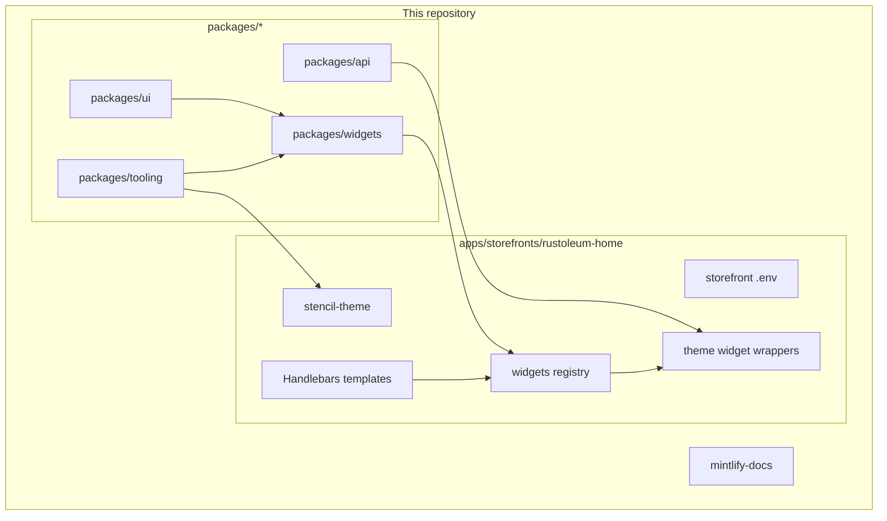
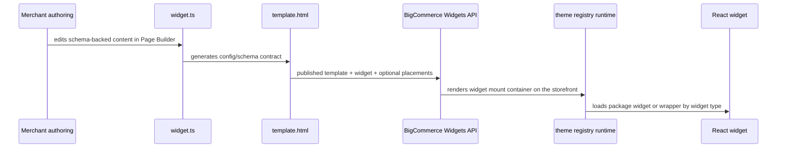

## System map

## Runtime model

The storefront is a hybrid Stencil + React system:

- Handlebars templates render the page shell and widget mount containers.
- `template.html` in each package widget serializes merchant-authored values into `data-*` attributes.
- The theme widget runtime reads `data-widget-type` and `data-widget-props`.
- `assets/js/framework/widgets/registry.js` resolves the widget type to either:
  - a direct package widget import from `@thesparklaboratory/rusto-widgets/...`, or
  - a theme-local wrapper when storefront data or theme-specific integration is required.

## Widget flow

## Sources of truth

| Concern | Source of truth |
| --- | --- |
| Shared theme tokens | `packages/ui/src/theme/theme.ts` and `packages/ui/src/theme/tokens.ts` |
| Widget authoring contract | `packages/widgets/src/widgets/<widget-name>/widget.ts` |
| Widget template handoff | `packages/widgets/src/widgets/<widget-name>/template.html` |
| Widget publish and placement commands | `packages/tooling/cli.ts` |
| Theme widget registration | `apps/storefronts/rustoleum-home/stencil-theme/assets/js/framework/widgets/registry.js` |
| Theme deployment bundle and push | `apps/storefronts/rustoleum-home/stencil-theme/scripts/*` and root `stencil:*` scripts |

## Build and dev flow

### `bun run dev`

The root `dev` command is the preferred local entrypoint.

It:

1. watches `packages/api`, `packages/ui`, and `packages/widgets`
2. rebuilds package `dist` output when those sources change
3. starts the Stencil theme server

Use this when you are working on package code and need the theme to pick up changes continuously.

### `bun run stencil:start`

This starts the theme server through the theme package scripts. Use it when you only need the theme runtime and already have current package build artifacts.

## Theme deployment boundary

Widget publishing and theme deployment are related but separate:

- `bun run widgets:publish` updates widget templates, widgets, and optional placements in BigCommerce.
- `bun run stencil:push` uploads the Stencil theme bundle and activates it.

If you change React widget runtime code, wrappers, the registry, Handlebars templates, SCSS, or other theme assets, you need a theme push.

If you change only the Page Builder manifest or widget template contract, widget publish may be enough.
