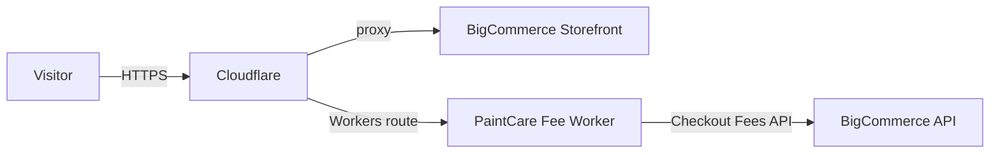
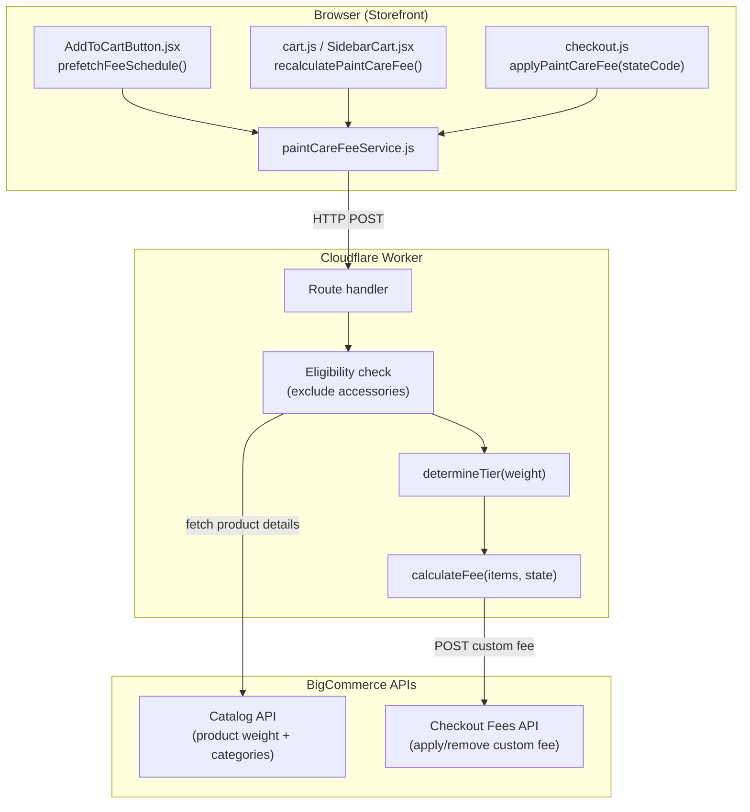

## Basic setup

Cloudflare sits between visitors and the BigCommerce storefront as a reverse proxy. All traffic to `rustoleumhome.com` routes through Cloudflare before reaching BigCommerce.



| Capability | How it is configured |
|------------|---------------------|
| **DNS proxy** | Cloudflare DNS manages `rustoleumhome.com`. The orange-cloud proxy is enabled so all requests pass through the Cloudflare edge. |
| **SSL / TLS** | Full (strict) mode — Cloudflare terminates TLS at the edge and re-encrypts to BigCommerce's origin. |
| **Caching** | Static assets (images, CSS, JS) are cached at the edge. HTML pages pass through to origin by default. |
| **Workers** | Edge functions bound to specific route patterns. The PaintCare fee worker handles `/api/paint-care-fee/*` and `/api/promotions`. |
| **WAF / Firewall** | Custom rules that block or challenge suspicious traffic before it reaches BigCommerce. |

## PaintCare fee worker

[PaintCare](https://www.paintcare.org/) is an environmental stewardship program that charges a recycling fee on qualifying paint products sold in participating states. A **Cloudflare Worker** calculates and applies this fee as a custom checkout fee in BigCommerce.

**Source code:** `apps/storefronts/rustoleum-home/stencil-theme/cloudflare-worker/paintcare-fee-worker.js`

**Worker URL:** `https://paintcare-fee-worker.submit-f65.workers.dev`

### Architecture



### How it works

1. **Trigger** — The storefront calls the worker when a shipping address is entered at checkout (`applyPaintCareFee`), when cart contents change (`recalculatePaintCareFee`), or when the cart is opened in the sidebar.

2. **Eligibility check** — The worker fetches each cart item's product details from the BigCommerce Catalog API (weight and category IDs). It then fetches category names and **excludes products in "accessories" categories**. Only non-accessory products qualify for the fee.

3. **Tier assignment** — Each eligible product is assigned a container-size tier based on its **weight in ounces**:

| Tier | Weight range | Description |
|------|-------------|-------------|
| **SM** | < 128 oz (< 1 gallon) | Larger than half pint up to smaller than 1 gallon |
| **MD** | 128–256 oz (1–2 gallons) | 1–2 gallons |
| **LG** | > 256 oz (> 2 gallons) | Larger than 2 gallons up to 5 gallons |

4. **Fee calculation** — The fee per unit is looked up from the schedule by `tier + stateCode`. The line fee is `feePerUnit * quantity`. All line fees are summed for the total.

5. **Application** — The worker removes any existing PaintCare fee from the checkout, then posts the new total as a BigCommerce custom checkout fee named **"PaintCare Environmental Fee"**.

### Participating states and fee schedule

Fees vary by state. The worker ships with a static fallback schedule and can optionally pull updated rates from a Google Sheet.

| State | SM | MD | LG |
|-------|------|------|------|
| CA | $0.30 | $0.65 | $1.50 |
| CO | $0.35 | $0.75 | $1.60 |
| CT | $0.50 | $1.15 | $2.25 |
| DC | $0.30 | $0.70 | $1.60 |
| IL | $0.45 | $0.95 | $1.95 |
| ME | $0.50 | $1.10 | $2.00 |
| MD | $0.50 | $1.15 | $2.25 |
| MN | $0.49 | $0.99 | $1.99 |
| NY | $0.45 | $0.95 | $1.95 |
| OR | $0.45 | $0.95 | $1.95 |
| RI | $0.35 | $0.75 | $1.60 |
| VT | $0.65 | $1.35 | $2.45 |
| WA | $0.65 | $1.45 | $2.75 |

<Info>
  These are the static fallback values hardcoded in the worker. If a `PAINTCARE_FEE_SOURCE_URL` is configured, the worker pulls updated rates from that source and only uses these as a fallback.
</Info>

### Managing fee rates via Google Sheet

The worker can pull fee rates from a client-managed Google Sheet (published as CSV) or a JSON endpoint. This lets non-developers update fee rates without redeploying the worker.

**How it works:**

1. The `PAINTCARE_FEE_SOURCE_URL` Cloudflare secret points to the published CSV/JSON URL
2. The worker fetches from this URL on first request and caches the result in memory
3. The cache refreshes every **30 days**; on fetch failure it retries every **5 minutes**
4. If the source is unavailable or returns invalid data, the worker falls back to the static in-code schedule

**Required CSV columns:**

| Column | Required | Description |
|--------|----------|-------------|
| `state_code` (or `state`, `state_abbr`) | Yes | Two-letter code (`CA`) or full state name (`California`) |
| `sm` (or `small`, `tier_sm`, `fee_sm`) | Yes | Fee for SM tier |
| `md` (or `medium`, `tier_md`, `fee_md`) | Yes | Fee for MD tier |
| `lg` (or `large`, `tier_lg`, `fee_lg`) | Yes | Fee for LG tier |
| `effective_date` (or `effective`, `starts_on`) | No | Start date (e.g. `2026-04-01`) — rows with future dates are ignored |
| `end_date` (or `ends_on`) | No | End date — expired rows are ignored |
| `active` (or `enabled`, `is_active`) | No | Set `false` / `0` / `no` / `inactive` to disable a row |

If multiple rows exist for the same state, the worker picks the most recent applicable row by `effective_date`. This supports scheduling rate changes in advance.

An example CSV is included in the repo at `cloudflare-worker/paintcare-fees.csv`.

### API endpoints

The worker exposes these endpoints, routed via Cloudflare Workers Routes on `rustoleumhome.com`:

| Method | Path | Description |
|--------|------|-------------|
| `POST` | `/api/paint-care-fee/apply` | Calculate fee and apply to checkout |
| `POST` | `/api/paint-care-fee/remove` | Remove PaintCare fee from checkout |
| `POST` | `/api/paint-care-fee/recalculate` | Re-fetch checkout state, recalculate, and apply |
| `GET` | `/api/paint-care-fee/schedule` | Return current fee schedule, tiers, and states |
| `POST` | `/api/paint-care-fee/invalidate` | Force-refresh the cached schedule from source |
| `GET` | `/api/promotions` | Return active coupon/promotion data (separate feature) |

**Apply request body:**

```json
{
  "checkoutId": "abc-123",
  "stateCode": "CA",
  "items": [
    { "productId": 456, "quantity": 2 }
  ]
}
```

**Recalculate request body** (reads state and items from the checkout directly):

```json
{
  "checkoutId": "abc-123"
}
```

### Client-side integration

The browser-side service at `assets/js/services/paintCareFeeService.js` manages all communication with the worker.

| Function | Called from | Purpose |
|----------|------------|---------|
| `prefetchFeeSchedule()` | `AddToCartButton.jsx` | Warm the schedule cache on PDP load (non-blocking) |
| `applyPaintCareFee(stateCode)` | `checkout.js` | Apply fee when shipping state is entered |
| `removePaintCareFee()` | `checkout.js` | Remove fee when state changes to non-PaintCare |
| `recalculatePaintCareFee()` | `cart.js`, `SidebarCart.jsx`, `shipping-estimator.js` | Recalculate when cart contents or shipping change |

The fee schedule is cached in `localStorage` under the key `paintcare_fee_schedule_v2` with a **24-hour TTL**. Concurrent fetch requests are deduplicated.

### PDP metafields

Two product metafields (namespace `ct_metafields`) are used to display PaintCare information on the PDP:

| Metafield key | Used in | Purpose |
|---------------|---------|---------|
| `paint_care_fee_code` | `ProductOptions.jsx` | Tier code (`SM`, `MD`, or `LG`) displayed on the PDP |
| `paintcare_fee_disclaimer` | `ProductOptions.jsx` | Disclaimer HTML shown below product options |

<Note>
  The worker determines eligibility **server-side** using product weight and category (not the `paint_care_fee_code` metafield). The metafield is only used for PDP display purposes.
</Note>

### Deployment

The worker lives in `apps/storefronts/rustoleum-home/stencil-theme/cloudflare-worker/` with three files:

| File | Purpose |
|------|---------|
| `paintcare-fee-worker.js` | Worker source code |
| `wrangler.toml` | Wrangler configuration (worker name, account ID, compatibility date) |
| `README.md` | Setup and endpoint reference |

<Steps>
  <Step title="Install Wrangler">

```bash
bun add -g wrangler
wrangler login
```

  </Step>
  <Step title="Set secrets">

```bash
cd apps/storefronts/rustoleum-home/stencil-theme/cloudflare-worker
wrangler secret put BC_STORE_HASH
wrangler secret put BC_ACCESS_TOKEN
wrangler secret put PAINTCARE_FEE_SOURCE_URL
```

The `BC_ACCESS_TOKEN` needs the **Checkout modify** scope (and **Marketing read-only** for the `/api/promotions` endpoint).

  </Step>
  <Step title="Deploy the worker">

```bash
wrangler deploy
```

  </Step>
  <Step title="Create Workers Routes in Cloudflare">

In the Cloudflare dashboard for `rustoleumhome.com`:

1. Go to **Workers Routes**
2. Add route: `rustoleumhome.com/api/paint-care-fee/*` → `paintcare-fee-worker`
3. Add route: `rustoleumhome.com/api/promotions` → `paintcare-fee-worker`

  </Step>
</Steps>

### How the fee appears in checkout

The fee is applied via the BigCommerce Checkout Fees API as a custom fee:

```json
{
  "name": "PaintCare Environmental Fee",
  "type": "custom_fee",
  "display_name": "PaintCare Environmental Fee",
  "cost": "1.30",
  "source": "PaintCare (CA)"
}
```

This shows as a separate line item in the order summary at checkout, distinct from tax and shipping.

## Robot blocking

Bots and AI scrapers are blocked at the Cloudflare level before traffic reaches BigCommerce. This protects against content scraping, inventory hoarding, and unnecessary origin load.

### What is blocked

| Category | Blocked | Method |
|----------|---------|--------|
| **Known AI scrapers** (GPTBot, CCBot, Google-Extended, etc.) | Yes | WAF custom rule matching `User-Agent` |
| **Unverified bots** (no reverse DNS, spoofed UA) | Challenged | Cloudflare managed challenge |
| **High-rate automated requests** | Rate-limited | Rate limiting rule |
| **Verified search engine bots** (Googlebot, Bingbot) | Allowed | Verified bot allowlist |

### How rules are configured

Bot blocking rules are managed in the **Cloudflare dashboard** under **Security > WAF > Custom rules**. Each rule specifies a match expression and an action:

```
(http.user_agent contains "GPTBot") or
(http.user_agent contains "CCBot") or
(http.user_agent contains "anthropic-ai")
→ Action: Block
```

### Modifying bot rules

1. Log in to the Cloudflare dashboard
2. Navigate to **Security > WAF > Custom rules**
3. Find the bot-blocking rule
4. Edit the expression to add or remove user agents
5. Save and deploy — changes take effect immediately at the edge

<Warning>
  Blocking legitimate search engine bots will hurt SEO. Always verify that Googlebot, Bingbot, and other search crawlers are excluded from block rules. Cloudflare's **Verified Bots** list handles this automatically when using Bot Management features.
</Warning>
