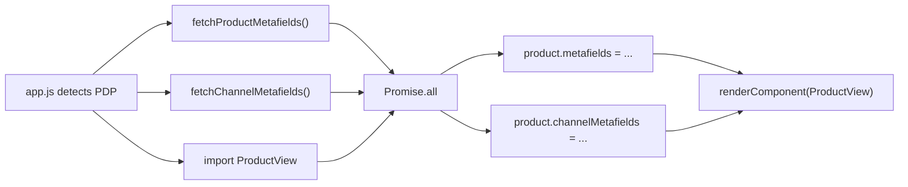

## Overview

The storefront uses **BigCommerce metafields** to store structured content that does not fit into standard product fields. All metafields use the namespace **`ct_metafields`** and are fetched via the Storefront GraphQL API at page load.

| Type | Scope | Fetched by | Consumed by |
|------|-------|------------|-------------|
| **Product metafields** | Per-product (specs, PaintCare, hero bullets, FAQs) | `fetchProductMetafields()` | `ProductAccordions`, `ProductOptions`, `DealsSection` |
| **Channel metafields** | Store-wide (shipping message, satisfaction badge, supplies image, FAQ page) | `fetchChannelMetafields()` | `DealsSection`, `ProductView`, FAQ pages |
| **Variant metafields** | Per-variant (color name, description) | `fetchVariantMetafields()` | `ProductOptions` |

All metafield logic lives in `assets/js/utils/metafields.js`.

## How metafields are fetched



When `app.js` detects a `product` page type, it runs three operations in parallel:

1. **Product metafields** — `initProductMetafields(container)` reads the `data-product-id` attribute, calls GraphQL, attaches the result to `data-metafields` on the container, and dispatches a `metafieldsLoaded` custom event on `window`.
2. **Channel metafields** — `fetchChannelMetafields()` with no arguments fetches the three default PDP keys and returns a plain `key → value` map.
3. **ProductView import** — Dynamic import of the React component.

The results are merged onto the `product` object and passed as props:

```js
product.metafields = metafields;          // Array<{ key, value }>
product.channelMetafields = channelMeta;  // { key: value }
renderComponent(productViewContainer, ProductView, { product, images, breadcrumbs, categories });
```

### GraphQL queries

**Product metafields** — fetches up to 50 metafields in the `ct_metafields` namespace:

```graphql
query ProductMetafields($productId: Int!) {
  site {
    product(entityId: $productId) {
      metafields(namespace: "ct_metafields", first: 50) {
        edges {
          node { key, value }
        }
      }
    }
  }
}
```

**Channel metafields** — fetches specific keys by name:

```graphql
query ChannelMetafields($keys: [String!]!) {
  channel {
    metafields(namespace: "ct_metafields", keys: $keys) {
      edges {
        node { key, value }
      }
    }
  }
}
```

**Variant metafields** — fetches `color_name` and `color_description` for all variants:

```graphql
query VariantMetafields($productId: Int!) {
  site {
    product(entityId: $productId) {
      variants(first: 100) {
        edges {
          node {
            entityId
            sku
            metafields(namespace: "ct_metafields", keys: ["color_name", "color_description"]) {
              edges {
                node { key, value }
              }
            }
          }
        }
      }
    }
  }
}
```

## Product metafields

All product metafields use the namespace `ct_metafields`. The keys are defined in `METAFIELD_KEYS` in `metafields.js`.

### PDP hero area

These metafields are consumed by `ProductOptions.jsx` and rendered in the hero section above the product options:

| Key | JS constant | Content type | Description |
|-----|-------------|--------------|-------------|
| `hero_short_description` | `heroShortDescription` | Plain text | Short description displayed below the product name |
| `hero_bullets` | `heroBullets` | JSON array | Bullet points for the PDP hero. Each entry can be a string (`"Bold text — Detail"`) or object (`{ text, detail }`) |

### Technical and safety data

These feed into the **Technical Information** accordion panel in `ProductAccordions`:

| Key | JS constant | Content type | Description |
|-----|-------------|--------------|-------------|
| `technical_specs` | `technicalSpecs` | HTML or JSON array | Product specifications. Supports WYSIWYG HTML or a legacy JSON array of strings (auto-converted to `<ul>`) |
| `tds_reference` | `tdsReference` | Plain text | Technical Data Sheet reference identifier |
| `tds_pdf_url` | `tdsPdfUrl` | URL | Link to the Technical Data Sheet PDF |
| `sds_reference` | `sdsReference` | Plain text | Safety Data Sheet reference identifier |
| `sds_pdf_url` | `sdsPdfUrl` | URL | Link to the Safety Data Sheet PDF |

### Usage and safety information

These feed into the **Usage Instructions** accordion panel:

| Key | JS constant | Content type | Description |
|-----|-------------|--------------|-------------|
| `usage_instructions` | `usageInstructions` | HTML | Application/usage instructions |
| `directions_note` | `directionsNote` | HTML | Additional directions note |
| `danger_message` | `dangerMessage` | HTML | Danger or hazard message |

### PaintCare

These display PaintCare information on the PDP via `ProductOptions.jsx`:

| Key | JS constant | Content type | Description |
|-----|-------------|--------------|-------------|
| `paint_care_fee_code` | `paintCareFeeCode` | Plain text (`SM`, `MD`, or `LG`) | Container size tier for PaintCare fee display |
| `paintcare_fee_disclaimer` | `paintCareFeeDisclaimer` | HTML | Disclaimer text shown below product options |

<Note>
  The `paint_care_fee_code` is for PDP display only. The Cloudflare Worker determines fee eligibility server-side using product weight and category. See [Cloudflare infrastructure](/dev/cloudflare) for details.
</Note>

### Regulatory and product details

| Key | JS constant | Content type | Description |
|-----|-------------|--------------|-------------|
| `prop_65_warning` | `prop65Warning` | HTML | California Prop 65 warning text, displayed in `ProductOptions.jsx` |
| `is_tint_base` | `isTintBase` | Boolean string | Flag indicating the product is a tint base |
| `shelf_life_days` | `shelfLifeDays` | Number string | Product shelf life in days |

### FAQ

| Key | JS constant | Content type | Description |
|-----|-------------|--------------|-------------|
| `faq_pdp_question_answer` | `pdpFaqs` | JSON array | Array of Q&A objects for the FAQ accordion. Each object supports keys: `faq_question`/`question`/`q` and `faq_answer`/`answer`/`a` |

### Deals and promotions

These are consumed by `DealsSection.jsx`:

| Key | JS constant | Content type | Description |
|-----|-------------|--------------|-------------|
| `deals_offers_promo_callout` | `dealsOffersPromoCallout` | HTML | Promotional callout (displayed with a tag icon) |
| `deals_offers_member_callout` | `dealsOffersMemberCallout` | HTML | Membership callout (displayed with a user icon) |
| `deals_offers_shipping_callout` | `dealsOffersShippingCallout` | HTML | Shipping callout (overridden by channel-level `shipping_message` if set) |
| `additional_supplies_copy` | `additionalSuppliesCopy` | HTML | Description text for the additional supplies block |

## Channel metafields

Channel metafields provide store-wide data. They also use the `ct_metafields` namespace.

### Default PDP keys

These are fetched automatically on every PDP load (defined in `DEFAULT_CHANNEL_KEYS`):

| Key | Used in | Content type | Description |
|-----|---------|--------------|-------------|
| `additional_supplies_image` | `DealsSection` | Image URL | URL for the additional supplies image |
| `satisfaction_message` | `DealsSection` | HTML | Satisfaction guarantee message (displayed with a smiley icon) |
| `shipping_message` | `DealsSection` | HTML | Shipping promotion message. **Overrides** the product-level `deals_offers_shipping_callout` when set |

### FAQ page key

Fetched separately by `fetchFaqPageContent()`:

| Key | Used in | Content type | Description |
|-----|---------|--------------|-------------|
| `faq_page_qa_list` | `FAQPageContent`, `FaqHighlightBlock` | JSON | Structured FAQ content with categories, questions, and answers. Parsed into categories and FAQ items for the FAQ page components |

## Variant metafields

Variant-level metafields are fetched per-variant using a separate query. These use the same `ct_metafields` namespace.

| Key | Used in | Description |
|-----|---------|-------------|
| `color_name` | `ProductOptions` | Display name for the color variant |
| `color_description` | `ProductOptions` | Description text for the color variant |

The `fetchVariantMetafields()` function returns a map of `variantEntityId → { color_name, color_description, sku }`.

## Where metafields appear on the PDP

### ProductAccordions

`ProductAccordions.jsx` renders expandable panels below the product options. Each panel only renders when its data is present.

| Panel ID | Title | Metafield keys | Other data sources |
|----------|-------|---------------|-------------------|
| `panel-details` | Product Details | *(none)* | `product.description` (standard BigCommerce field) |
| `panel-technical` | Technical Information | `technical_specs`, `sds_pdf_url`, `tds_pdf_url` | — |
| `panel-usage` | Usage Instructions | `usage_instructions`, `directions_note`, `danger_message` | `product.warranty` (standard field) |
| `panel-faq` | Frequently Asked Questions | `faq_pdp_question_answer` | — |

The **Product Details** panel is expanded by default; all others are collapsed.

### DealsSection

`DealsSection.jsx` renders supplemental info between the product options and the accordions. It combines product metafields and channel metafields.

| Row | Icon | Data source | Priority |
|-----|------|-------------|----------|
| Promo | tag | Product: `deals_offers_promo_callout` | — |
| Membership | user | Product: `deals_offers_member_callout` | — |
| Shipping | package | Channel: `shipping_message` **or** Product: `deals_offers_shipping_callout` | Channel takes precedence |
| Satisfaction | smiley | Channel: `satisfaction_message` | — |

The **additional supplies block** combines product-level `additional_supplies_copy` (description text) with channel-level `additional_supplies_image` (image URL).

### ProductOptions (hero area)

`ProductOptions.jsx` renders metafield data in the PDP hero area above the options:

- `hero_short_description` — short text below the product name
- `hero_bullets` — bullet points with bold text and detail
- `prop_65_warning` — Prop 65 warning message
- `paintcare_fee_disclaimer` — PaintCare disclaimer HTML

## Managing metafields in BigCommerce

### Viewing existing metafields

- **API**: `GET /v3/catalog/products/{id}/metafields`
- **Channel metafields API**: `GET /v3/channels/{channel_id}/metafields`

<Warning>
  Metafields are different from BigCommerce **Custom Fields**. Custom Fields are visible in the admin product editor. Metafields are managed via the API or the Advanced Metafields app.
</Warning>

### Creating a new product metafield

<Steps>
  <Step title="Create the metafield via the API">

```bash
curl -X POST \
  'https://api.bigcommerce.com/stores/{store_hash}/v3/catalog/products/{product_id}/metafields' \
  -H 'X-Auth-Token: {api_token}' \
  -H 'Content-Type: application/json' \
  -d '{
    "namespace": "ct_metafields",
    "key": "your_new_key",
    "value": "<p>Your content here</p>",
    "permission_set": "read_and_sf_access"
  }'
```

The `permission_set` **must** be `read_and_sf_access` for the metafield to be accessible via the Storefront GraphQL API.

  </Step>
  <Step title="Add the key to METAFIELD_KEYS">

In `assets/js/utils/metafields.js`, add the new key to the `METAFIELD_KEYS` object:

```js
export const METAFIELD_KEYS = {
  // ...existing keys
  yourNewKey: 'your_new_key',
};
```

  </Step>
  <Step title="Create a getter function">

Add a getter in the same file:

```js
export const getYourNewKey = ({ metafields }) => {
  return getMetafieldValue(metafields, METAFIELD_KEYS.yourNewKey);
};
```

  </Step>
  <Step title="Wire it into the component">

Import and use the getter in the relevant React component. For accordion content, add an entry to the sections array in `ProductAccordions.jsx`.

  </Step>
  <Step title="Deploy the theme">

Run `npm run push` to deploy the updated Stencil theme.

  </Step>
</Steps>

### Adding a new channel metafield

For channel metafields that should load on every PDP, add the key to `DEFAULT_CHANNEL_KEYS` in `metafields.js`:

```js
const DEFAULT_CHANNEL_KEYS = ['additional_supplies_image', 'satisfaction_message', 'shipping_message', 'your_new_key'];
```

For channel metafields used on specific pages only, call `fetchChannelMetafields({ keys: ['your_key'] })` explicitly.

## Troubleshooting

| Issue | Likely cause | Fix |
|-------|-------------|-----|
| Metafield not returned by GraphQL | Wrong `permission_set` | Update the metafield to `permission_set: "read_and_sf_access"` via the API |
| Accordion section is empty | Metafield has no value for this product | Set the metafield value via the API for that product |
| New accordion section not appearing | Key not wired into `ProductAccordions` | Add the key to `metafieldData` and `accordionSections` in the component |
| Channel metafield not showing | Wrong channel or not in `DEFAULT_CHANNEL_KEYS` | Ensure the metafield is on channel ID 1 and the key is in the default keys array |
| `metafieldsLoaded` event not firing | Product ID missing from container | Check that `data-product-id` is set on `#react-product-view` |
| FAQ data not parsing | Invalid JSON in `faq_pdp_question_answer` | Validate the JSON structure — must be an array of objects with `question`/`answer` keys |
| Hero bullets not showing | Invalid JSON in `hero_bullets` | Must be a JSON array of strings or `{ text, detail }` objects |
| `technical_specs` rendering as raw text | Legacy JSON array format | Both formats are supported — JSON arrays are auto-converted to `<ul>` lists |
