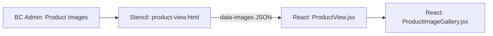

## Image data flow

Product images follow this path from BigCommerce to the rendered PDP:



### Step 1: BigCommerce stores images

Product images and their alt text are managed in BigCommerce admin under **Products > [Product] > Images & Videos**.

### Step 2: Handlebars serializes to JSON

The `product-view.html` template builds a JSON array in the `data-images` attribute:

```handlebars
data-images='[
  {{#each product.images}}
    {
      "data":"{{getImageSrcset this ...}}",
      "alt":"{{this.alt}}"
    }{{#unless @last}},{{/unless}}
  {{/each}}
]'
```

Each image becomes an object with `data` (responsive srcset URLs) and `alt` (the alt text from BC admin).

### Step 3: React parses and renders

`ProductView.jsx` parses the JSON string into an array and passes it to `ProductImageGallery.jsx`. If the parsed array is empty, it falls back to `product.images` from the full product JSON.

## The `?finish=` and `?color=` query parameter

This is the key mechanism for linking to a product and showing a specific image in the gallery.

**How it works:**

1. A URL like `/product-name/?finish=Natural` is loaded
2. `ProductView.jsx` reads the `finish` (or `color`) query parameter
3. It normalizes the value: lowercased, hyphens/underscores/spaces stripped
4. It searches through the product images' `alt` text for a match
5. The gallery scrolls to the matching image

```js
const initialGalleryIndex = useMemo(() => {
  if (!initialOptionParam || !baseImages.length) return 0;
  const normalize = (str) => (str || '').toLowerCase().replace(/[-_\s]+/g, '');
  const target = normalize(initialOptionParam);
  const idx = baseImages.findIndex(img => normalize(img.alt) === target);
  return idx >= 0 ? idx : 0;
}, [initialOptionParam, baseImages]);
```

**This means**: for a product link with `?finish=Natural` to work, one of the product's images must have alt text that normalizes to `natural`. The alt text `"Natural"`, `"natural"`, or `"NATURAL"` would all match.

<Warning>
  There is no flooring-kit-specific code. All product types use the same image/alt matching logic. If a flooring kit's gallery is not showing the correct image, check the alt text on the product images in BigCommerce admin.
</Warning>

## Variant image handling

When a customer selects a product variant (e.g., a color swatch), the following happens:

1. The hidden Stencil form fires an `onProductOptionsChanged` custom event
2. `ProductView.jsx` listens for this event and extracts the variant's image URL
3. It checks if the variant image already exists in the gallery (by comparing filenames)
4. If it exists, the gallery scrolls to that image
5. If it does not exist, the variant image is **prepended** to the gallery as the first image

```js
const variantImg = { data: variantImageUrl, alt: 'Product image' };
return {
  parsedImages: [variantImg, ...baseImages],
  variantMatchIndex: 0,
};
```

## Alt text best practices

| Scenario | Recommended alt text |
|----------|---------------------|
| Finish/color variant image | The finish name exactly: `Natural`, `Slate`, `White` |
| Main product hero image | Product name: `Rust-Oleum HOME Floor Coating Kit` |
| Lifestyle/in-use photo | Descriptive: `Kitchen with natural finish floor coating` |
| Detail/texture shot | `Natural finish close-up texture` |

The first image in the list (by upload order in BC admin) is the default gallery image when no query parameter is present.

## Troubleshooting

| Issue | Cause | Fix |
|-------|-------|-----|
| Wrong image shows on load | Alt text does not match `?finish=` value | Update alt text in BC admin to match |
| Gallery shows generic "Product image" alt | Variant image was prepended without a real alt | Ensure the variant has an assigned image in BC admin |
| No image shows at all | `data-images` array is empty | Check that the product has images uploaded in BC admin |
| Image is blurry | Srcset resolved to a small size | Upload a higher-resolution source image |
