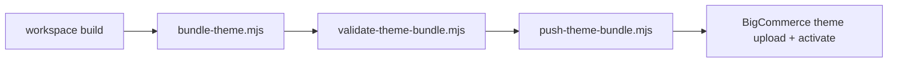

## Primary deployment command

From the repo root:

```bash
bun run stencil:push
```

This is the canonical theme deployment entrypoint.

## What `stencil:push` does

The root script runs:

1. a publish git gate
2. the theme `push` script in `apps/storefronts/rustoleum-home/stencil-theme`

The theme `push` script then runs:

1. `bundle`
2. `bundle:validate`
3. `bundle:push`

## Bundle flow

The theme bundle pipeline is:



## Related root scripts

| Command | Purpose |
| --- | --- |
| `bun run stencil:bundle` | build a theme bundle without pushing |
| `bun run stencil:pull` | pull the remote theme |
| `bun run stencil:push` | build, validate, and push the theme |
| `bun run stencil:release` | run the theme release flow |

## Git gate requirements

`bun run stencil:push` is protected by a publish git gate.

Before it will run, the repo must be:

- on `main`
- clean with no local changes
- in sync with `origin/main`

If the repo is ahead, behind, or dirty, the command fails fast.

<Warning>
  Theme push is intentionally stricter than normal local development. Plan your release flow so the repo is clean and synchronized before pushing.
</Warning>

## Theme upload limit behavior

The push script can recover from the BigCommerce private theme upload limit:

- in interactive mode, it lets you choose inactive private themes to delete
- in non-interactive mode, it auto-selects older inactive private themes for cleanup

After cleanup, it retries the push.

## When to push the theme

Run `bun run stencil:push` when you change any of these:

- theme templates
- widget registry wiring
- theme wrappers
- SCSS
- bundled JavaScript
- package widget runtime code used by the theme

## Widget publish vs theme push

These are different operations:

| Operation | Updates |
| --- | --- |
| `bun run widgets:publish` | widget templates, widgets, and optional placements |
| `bun run stencil:push` | the Stencil theme bundle |

If you change both the Page Builder contract and the storefront runtime, you usually need both.
