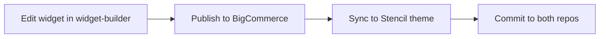

## Why sync?

Widget source files live in two places:

1. **`widget-builder/`** — The development and publishing source of truth
2. **`ro-web-bigcommerce/.../custom-widgets-backup/`** — A version-controlled backup in the Stencil theme repo

The sync script keeps these in sync so that both repos have the latest widget files committed.

<Note>
  The `custom-widgets-backup/` directory is listed in `.stencilignore`. It is **not** included in the Stencil theme bundle that gets pushed to BigCommerce. It exists purely for version control and reference.
</Note>

## Sync commands

All commands are run from the `widget-builder/` directory (or the matching script in the Stencil theme directory).

### Copy a widget to the Stencil theme

```bash
./sync-widgets.sh to-stencil <widget-name>
```

Copies `widget.html`, `config.json`, `schema.json`, `meta.json`, and `widget.yml` (if present) from `widget-builder/<widget-name>/` to the Stencil backup directory.

### Copy a widget from the Stencil theme

```bash
./sync-widgets.sh from-stencil <widget-name>
```

Reverse direction — copies from the Stencil backup into widget-builder.

### Sync all widgets

```bash
./sync-widgets.sh sync-all
```

Copies every widget folder that contains a `widget.html` from widget-builder to the Stencil theme.

### List available widgets

```bash
./sync-widgets.sh list
```

Shows all widget directories in both widget-builder and the Stencil theme.

## Default paths

The sync script auto-detects paths based on the repository layout:

| Variable | Default value |
|----------|--------------|
| Widget Builder dir | The script's own directory |
| Stencil widgets dir | `../ro-web-bigcommerce/stencil-themes/rustoleum-home/custom-widgets-backup/custom-widgets` |

Override with environment variables:

```bash
WIDGET_BUILDER_PATH=/custom/path ./sync-widgets.sh to-stencil MyWidget
STENCIL_WIDGETS_PATH=/custom/path ./sync-widgets.sh to-stencil MyWidget
```

## Complete workflow



### Step by step

```bash
# 1. Develop the widget
cd widget-builder
widget-builder start MyWidget

# 2. Publish to BigCommerce
widget-builder publish MyWidget

# 3. Sync to Stencil theme
./sync-widgets.sh to-stencil MyWidget

# 4. Commit changes in widget-builder
git add MyWidget/
git commit -m "Update MyWidget widget"

# 5. Commit changes in Stencil theme
cd ../ro-web-bigcommerce
git add stencil-themes/rustoleum-home/custom-widgets-backup/custom-widgets/MyWidget/
git commit -m "Sync MyWidget widget from widget-builder"
```

## Files copied during sync

| File | Synced |
|------|--------|
| `widget.html` | Yes |
| `config.json` | Yes |
| `schema.json` | Yes |
| `meta.json` | Yes (if present) |
| `widget.yml` | Yes (if present) |
| `query.graphql` | No |
| `queryParams.json` | No |
