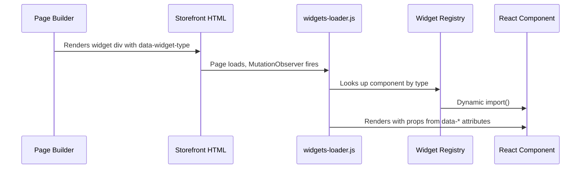

## What is a widget?

A widget is a reusable content block that content editors can drag onto pages in BigCommerce Page Builder. Each widget consists of:

- A **Handlebars template** (`widget.html`) that outputs HTML with `data-*` attributes
- A **schema** (`schema.json`) that defines the editing UI in Page Builder
- A **React component** in the Stencil theme that hydrates the widget on the live storefront

## The widget registry

When the storefront loads, `widgets-loader.js` scans the page for elements with `data-widget-type` attributes and maps each type to a React component.

```js
const widgetRegistry = {
  'herocarousel': () => import('./components/HeroCarousel.jsx'),
  'herosectioncarousel': () => import('./components/HeroCarousel.jsx'),
  'benefits': () => import('./components/BenefitsBlock.jsx'),
  'how-it-works': () => import('./components/HowItWorks.jsx'),
  'howitworks': () => import('./components/HowItWorks.jsx'),
  'blog-articles': () => import('./components/BlogArticles'),
  'galleryblock': () => import('./components/GalleryBlock.jsx'),
  // ... 50+ more entries
};
```

Most widgets have multiple aliases (e.g., `hero-carousel` and `herocarousel` both resolve to the same component). This is intentional — it handles different naming conventions between widget templates.

## PDP widget priority

On product detail pages, the loader prioritizes certain widgets to ensure the above-the-fold experience loads first:

```js
const PDP_FIRST_WIDGET_TYPES = ['product-image-gallery', 'productimagegallery'];
```

Other PDP widgets (like HowItWorks, ProcessSection) wait for the `pdp-main-ready` flag, which is set after `ProductView` finishes rendering.

## Widget hydration flow



## Lazy loading

All React and MUI imports are loaded dynamically. The `getReactModules()` function is shared between `widgets-loader.js` and `app.js` to prevent duplicate React instances:

```js
export const getReactModules = async () => {
  if (!reactModules) {
    const [React, ReactDOM, MuiStyles, CssBaseline, rustoleumHomeTheme] =
      await Promise.all([
        import('react'),
        import('react-dom/client'),
        import('@mui/material/styles'),
        import('@mui/material/CssBaseline'),
        import('./themes/rustoleumHomeTheme'),
      ]);
    // ...
  }
  return reactModules;
};
```
