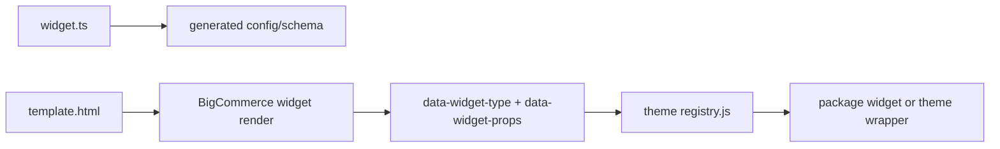

## The current widget model

A widget in this repo is a package-backed Page Builder surface made from three layers:

1. `widget.ts` defines the merchant-facing schema, translations, defaults, and optional placements.
2. `template.html` is the Stencil SSR handoff that serializes props into the DOM.
3. the React implementation renders the widget on the storefront or in Page Builder preview.

## Authoritative widget location

All package widgets live under:

```text
packages/widgets/src/widgets/<widget-name>/
```

That folder is the authoritative implementation surface for package-backed widgets.

## Runtime flow



## Registry model

The theme registry lives at:

```text
apps/storefronts/rustoleum-home/stencil-theme/assets/js/framework/widgets/registry.js
```

Each entry registers one or more widget types and points to a runtime loader.

There are two common patterns:

| Pattern | Use when |
| --- | --- |
| direct package widget import | the widget is fully presentational and can run from package props alone |
| theme wrapper import | the widget needs storefront data, theme-side data shaping, or runtime orchestration |

## Package widget vs wrapper

Use a direct package widget when:

- the widget can render entirely from author-provided props
- all necessary data can be serialized in `template.html`

Use a theme wrapper when:

- the widget needs storefront APIs or theme runtime data
- the widget needs product, review, resource, or other runtime hydration
- the theme must normalize or augment props before render

## Widget publish boundary

Publishing a widget updates BigCommerce widget resources:

- widget template
- widget
- optional placements

It does **not** deploy the Stencil theme bundle.

If you change the React widget implementation, wrapper behavior, registry wiring, or any other theme code, you still need a theme push after the widget publish flow.

## Placement model

Widget placements can be defined in `widget.ts`:

```ts
placements: [{ channelId: 1, page: "pages/home", region: "", status: "active" }]
```

Important details:

- placement updates are opt-in during publish
- publish defaults to leaving existing placements alone
- pass `--update-placements` when you want the publish flow to apply manifest placements or placement override flags

## Publishability requirements

For a widget to be publishable, it needs:

- a widget folder under `packages/widgets/src/widgets/<widget-name>`
- `widget.ts` or `config.json`
- `template.html`
- registration in the theme registry if you want it to be selectable through the registered publish flow

## Related pages

- [Creating widgets](/dev/creating-widgets)
- [Widget manifest and file contract](/dev/widget-files)
- [Publishing and updating widgets](/dev/publishing-widgets)
- [Widget CLI reference](/dev/syncing-widgets)
